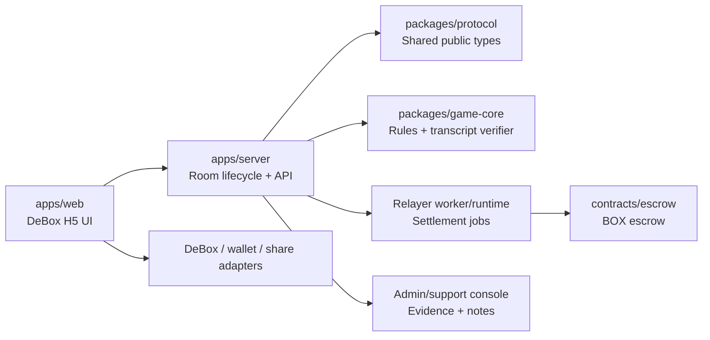
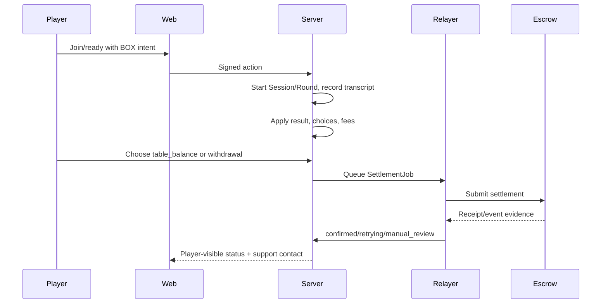

# Open-Source Trust Packaging

This project is intended to be inspectable before any real BOX room is enabled. The trusted surface is split so reviewers can audit rules, lifecycle, money movement, and operations separately.

## Module Authority

- `packages/game-core` owns card classification, turn legality, trustee rules, multiplier cap, settlement delta calculation, and transcript hash-chain verification.
- `apps/server` owns room membership, single-active-room enforcement, signed action verification, settlement choices, transcript/audit evidence, and player-private room views.
- `contracts/escrow` owns BOX deposit/lock/settlement/withdrawal accounting once deployed.
- Relayer code owns submission, retry, receipt polling, and reconciliation. It does not decide card results.
- `apps/web` presents the state and sends actions; it is not authoritative for money or rules.

## Money Flow

Important user-facing guarantees:

- v1 asset is BOX only on BSC.
- Platform fee is profit-only, initially 0.1%.
- Multiplier is capped at 16x.
- Exiting or kicked players default to withdrawal.
- Remaining players may choose table balance or withdrawal before settlement is queued.
- Once settlement is queued, the route is locked as evidence.
- Manual review is non-punitive and must show support contact.

## Current Local Evidence

- `npm run spec:validate`
- `npm run security:audit:prod`
- `npm run prelaunch:audit`
- `npm run typecheck`
- `npm run build`
- `npm test`
- `npm run contract:check`
- `npm run frontend:acceptance`
- `npm run frontend:browser-acceptance:launch`
- `npm run staging:readiness-report`
- `npm run staging:handoff`
- `npm run staging:package`
- `npm run release:gates`

Browser screenshots are written to `artifacts/browser-acceptance/`.
Staging readiness reports are written to `artifacts/staging-readiness/`.
The operator handoff is written to `artifacts/staging-readiness/staging-operator-handoff.md`.
The VPS staging package manifest/archive are written to `artifacts/staging-release/`.
Production dependency audit evidence is written to `artifacts/security/dependency-audit-prod.json`.
Prelaunch completion audit evidence is written to `artifacts/prelaunch/`.

Companion review documents:

- `docs/threat-model.md`
- `docs/release-verification-checklist.md`
- `docs/production-launch-runway.md`
- `docs/vps-staging-deployment.md`
- `docs/admin-key-policy.md`
- `docs/staging-monitoring-checklist.md`
- `docs/bsc-staging-relayer-runbook.md`
- `artifacts/staging-readiness/staging-readiness-report.md`
- `artifacts/staging-readiness/staging-operator-handoff.md`
- `artifacts/staging-release/manifest.json`
- `artifacts/security/dependency-audit-prod.json`
- `artifacts/prelaunch/prelaunch-completion-audit.md`
- `artifacts/prelaunch/prelaunch-completion-audit.json`

## Still Not Claimed

This repository does not yet claim broad public production real-BOX readiness. The machine-readable source of truth is `docs/release-gates.json`; at the latest local check, the only incomplete blocking gate is `public-production-release-approval`.

The approval gate must review the current launch-window evidence before public expansion, including dynamic browser money-flow evidence, real DeBox/App evidence, live VPS evidence, monitoring, support, and rollback readiness. Localhost browser soak evidence must not be described as real-device or public-production approval by itself.

Already archived for v1 classic/trusted-relayer launch: production credentials, open-access platform posture, DeBox runtime/frontend evidence, BSC deployment/source verification evidence, BSC relayer evidence, independent Codex contract review, v1 admin key policy, v1 operations acceptance, and production synthetic monitoring. Paid audit, player per-session authorization, multisig, formal key rotation, compensation pool, and tamper-resistant external audit retention remain post-v1 upgrades.
