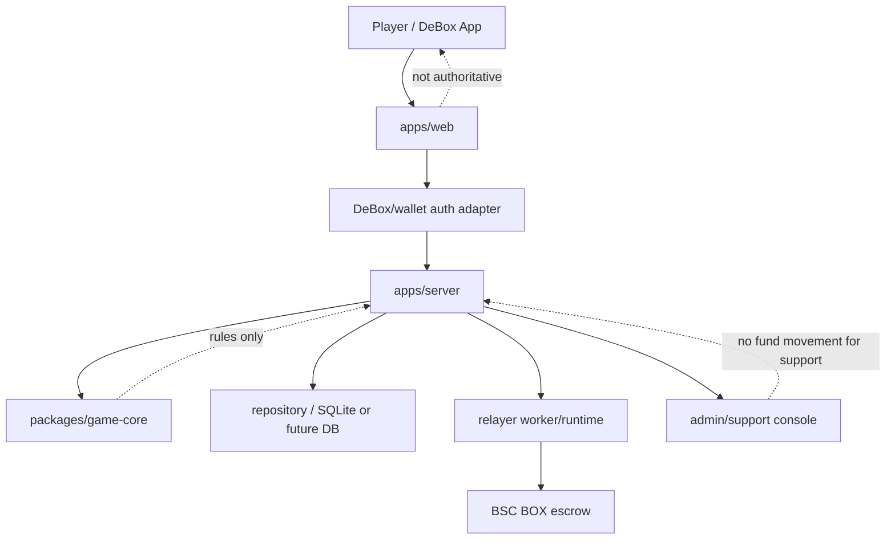

# Threat Model

本文记录 BOX 斗地主 v1 在可上线前测试阶段的主要安全风险、当前缓解措施和仍然阻塞真实上线的事项。它不是审计报告；它用于让代码审查、DeBox 接入、合约 review 和运营值班围绕同一张风险表推进。

## Scope

纳入范围：

- DeBox H5/MiniApp 前端。
- Room lifecycle server、签名 action、player-private room view。
- game-core 规则、transcript hash chain 和 replay verifier。
- SettlementJob、relayer worker/runtime、BSC escrow adapter 边界。
- Solidity BOX escrow 草案。
- admin/support console、operations status、manual-review 流程。

暂不纳入范围：

- DeBox 官方生产账号本身的账号安全。
- 真实私钥托管和硬件签名方案。
- 地域合规、KYC、AML 或平台政策判断。
- 独立第三方合约审计结论。

## Risk Register

| Risk | Why It Matters | Current Mitigation | Remaining Blocker |
| --- | --- | --- | --- |
| Private hand leakage | 斗地主一旦暴露对手手牌，资金局信任直接失效。 | `roomView` 默认公开视图不返回手牌，player view 只返回 viewer 自己手牌；admin/internal evidence 保留权威全量状态；HTTP 和 WebSocket 测试覆盖 redaction。 | DeBox authenticated viewer binding 还没官方确认；生产必须把本地 `viewerId` 替换为 DeBox/钱包认证后的身份。 |
| Action replay | 重放 join/ready/play/pass/settlement-choice 会破坏房间状态或结算证据。 | `SignedActionEnvelope` 校验 actionId、nonce、expiry、roomId、action type、signer/player 一致；nonce/actionId 已落库；测试覆盖重启后 replay 拒绝。 | DeBox 官方签名字段和钱包签名方法仍待确认。 |
| Settlement replay | 重复提交同一 settlementId/nonce 可能重复释放或污染人工处理。 | Escrow 合约测试覆盖 settlementId/nonce replay；relayer worker 有 claim lease、duplicate submission protection 和 manual_review fail-closed。 | 真实 BSC event decoding、RPC submitter 和 receipt reconciliation 仍需生产集成测试。 |
| Server randomness abuse | 如果服务器单方控制洗牌，玩家无法信任牌局。 | 服务端在等待下一局时先写入 `nextRoundServerCommitment`，玩家 ready nonce 绑定该承诺；三人 ready 后 reveal `serverNonce`，并由 `game-core` 的 `deriveDdzRoundDeal()` 统一复算 seed、first bidder、deal 和 replay fixture。 | 公开生产前仍需外部签字确认当前 P0/P1 证据和 browser money-flow 回归。 |
| Missing reveal or bad deal evidence | 随机承诺不匹配时不能让牌局照常结算。 | reveal mismatch 会进入 `system_exception`，不产生发牌和资金结算；support console 可处理异常并保留 audit。 | DeBox 生产 runtime 下的断线/刷新/恢复策略仍需验收。 |
| Relayer failure | RPC、gas、pending、revert 或 receipt mismatch 会导致用户以为资金卡住。 | SettlementCoordinator 分类错误；worker retry 后进入 manual_review；operations status 汇总 delayed、retrying、manual_review 和 failureCategories；UI 显示后台结算和支持入口；v1 接受先用人工处理兜底。 | 真实 BSC lock/settlement txs、receipts、event decode 和 reconciliation evidence 仍需归档；更重告警和值班体系进入 post-v1。 |
| Admin/support abuse | 普通客服如果能改钱或发链上交易，信任边界会崩。 | support token 只能看证据、加备注、标记 manual_review；普通 support console 没有改余额、改 fee、改 treasury、发交易入口；audit log 记录 support note；v1 admin key policy 已归档。 | 多签、硬件钱包、正式轮换、不可篡改审计留存和更细 RBAC 保留为 post-v1。 |
| Secret exposure | API key、App Secret、RPC URL token、私钥如果进前端或日志会造成直接损失。 | operations/admin responses 只返回 credential-safe 摘要；生产凭据 evidence 已脱敏归档；release gates 仍要求 DeBox runtime、frontend acceptance、BSC deployment/source verification 和 relayer evidence。 | 生产 secret manager、日志脱敏巡检和 secrets scanning 流程仍需落地；不作为当前 v1 classic 首发额外 gate。 |
| DeBox auth spoofing | 本地 mock 身份如果被误当生产身份，玩家可以冒充他人读状态或发 action。 | 真实资金 gate 明确阻塞 DeBox production credentials、wallet signature method、runtime diagnostics；当前 local/mock 模式不声明真实上线。 | 需要 DeBox 官方登录字段、签名方式、viewer binding 和 App 内 HTTPS 诊断证据。 |
| UI settlement confusion | 用户不知道钱是留桌、提现、清算中还是人工处理，最容易产生不信任。 | 前端增加 settlement choice panel、player notice、kicked/exited/manual-review copy；Playwright 桌面/手机验收截图检查可读性和 overflow。 | DeBox App 内真实机型验收、最终 support group/contact 和生产文案还需确认。 |
| Fee or config surprise | 费率、封顶、档位如果悄悄变化，会被认为不公平。 | `release-gates.json` 固定 BOX、BSC、初始 0.1% profit-only fee、16x cap；money-config docs 要求公告和 effective time，不影响 active Session。 | feeRateMax、treasury address、生产变更权限仍需 owner 审批。 |

## Trust Boundaries

Authority summary:

- Frontend can request actions and render state, but cannot decide money movement.
- Server owns membership, action verification, lifecycle transitions, settlement choices, audit and player-private views.
- game-core owns deterministic rules and replay logic.
- Escrow owns token accounting after deployment.
- Relayer owns submission and reconciliation, not game results.
- Support can record evidence and escalate, not move funds.

## Production Release Conditions

Before real BOX rooms are enabled:

- `npm run release:gates:enforce` must pass with `launchAllowed = true`; until `public-production-release-approval` is complete, the command is expected to block broad public Real BOX launch.
- DeBox official auth, signature and viewer binding evidence must be recorded.
- BSC escrow deployment/source verification, BSCScan URL, deployment tx, and on-chain readback must be recorded.
- Production relayer RPC, gas, receipt reconciliation and alerting must be tested.
- Production support group/contact must be configured and visible in player states.
- V1 admin, relayer, owner, treasury and emergency key policy must be approved. Multisig, player settlement authorization, paid audit and heavier custody controls are post-v1 upgrades unless a new concrete incident or platform requirement appears.
